# 🗣️ Keyword Spotting for the Kyrgyz Wake Word "Akylai"

This project focuses on the **Keyword Spotting (KWS)** task — detecting the Kyrgyz wake word **"Akylai"** in short audio clips.

The problem is formulated as a **binary classification task**:

- **1** — the audio contains the keyword **"Akylai"**;
- **0** — the audio does not contain the keyword.

Rather than focusing solely on maximizing classification metrics, this project investigates how different machine learning algorithms behave on the Keyword Spotting task. In addition to model comparison, the study includes hyperparameter tuning, decision threshold optimization, source-based error analysis, and the selection of a model suitable for real-time streaming inference.

[](https://huggingface.co/spaces/lunarrray/akylai-kws)

---

## Final Result

Selected model: Logistic Regression

Deployment threshold: 0.45

| Metric | Value |
|---------|------:|
| Accuracy | **0.9576** |
| Precision | **0.9049** |
| Recall | **0.9280** |
| F1-score | **0.9163** |
| ROC-AUC | **0.9896** |
| PR-AUC | **0.9663** |

Although Gradient Boosting achieved slightly higher ROC-AUC and PR-AUC values, Logistic Regression demonstrated better Recall and F1-score while requiring significantly lower computational resources. After threshold optimization, the model achieved an effective balance between Precision and Recall, making it well suited for streaming keyword spotting applications.

---

## Technologies

- Python 3.12
- scikit-learn
- NumPy
- Pandas
- Matplotlib
- Joblib
- Jupyter Notebook

---

## Project Pipeline

The project covers the complete machine learning workflow:

- Exploratory Data Analysis (EDA);
- data preprocessing;
- baseline modeling;
- linear models;
- tree-based and ensemble methods;
- hyperparameter tuning;
- threshold optimization;
- error analysis by audio source;
- final model selection;
- streaming inference demonstration.

---

## Table of Contents

1. [Project Overview](#1-project-overview)
2. [Dataset](#2-dataset)
3. [Exploratory Data Analysis](#3-exploratory-data-analysis)
4. [Data Preprocessing](#4-data-preprocessing)
5. [Baseline Model](#5-baseline-model)
6. [Linear Models](#6-linear-models)
7. [Tree-Based Models and Ensembles](#7-tree-based-models-and-ensembles)
8. [Model Selection and Threshold Optimization](#8-model-selection-and-threshold-optimization)
9. [Error Analysis](#9-error-analysis)
10. [Final Model Selection](#10-final-model-selection)
11. [Streaming Inference](#11-streaming-inference)
12. [Project Structure](#12-project-structure)
13. [Installation](#13-installation)
14. [Conclusion](#14-conclusion)

---

# 1. Project Overview

Keyword Spotting (KWS) is the task of detecting a predefined keyword or short phrase in an audio stream. It is widely used in voice assistants and embedded devices, where a lightweight model continuously monitors incoming audio and activates a larger speech recognition system only after detecting a wake word.

In this project, the target keyword is the Kyrgyz wake word **"Akylai"**. The objective is to determine whether a short audio clip contains this keyword.

The dataset consists of **40,000 audio samples** represented by **250 pre-extracted acoustic features**, allowing the problem to be formulated as a binary classification task.

Formally, the classifier estimates the probability

\[
P(\text{keyword} \mid x)
\]

where \(x\) is an audio clip represented by a vector of acoustic features.

A prediction is obtained by comparing this probability with a decision threshold:

```text
prediction = 1, if P(keyword | x) ≥ τ
prediction = 0, otherwise
```

To investigate the suitability of different machine learning approaches for Keyword Spotting, five classification algorithms were evaluated:

- Logistic Regression
- SGDClassifier
- Decision Tree
- Random Forest
- Gradient Boosting

The models were compared using Accuracy, Precision, Recall, F1-score, ROC-AUC, and PR-AUC. In addition to overall performance, the study includes hyperparameter tuning, threshold optimization, source-based error analysis, and a comparison of model suitability for deployment in a real-time streaming application.

# 2. Dataset

The project uses the **Akylai KWS dataset**, which contains short audio clips represented by pre-extracted acoustic features. Each sample corresponds to a single audio recording and is represented as a fixed-length numerical feature vector, allowing the Keyword Spotting task to be formulated as a binary classification problem.

## Dataset Overview

The dataset contains:

- **40,000 audio samples**
- **250 numerical acoustic features**
- **1 target variable (`label`)**
- **1 metadata column (`source`)**

Each row represents one audio clip.

## Dataset Structure

| Column | Description |
|----------|-------------|
| `label` | Target variable (`1` — contains the keyword **"Akylai"**, `0` — does not contain the keyword) |
| `source` | Metadata describing the origin of the audio sample |
| Acoustic features | Pre-extracted numerical descriptors of the audio signal |

The acoustic features include:

- MFCC coefficients;
- Mel Spectrogram statistics;
- Chroma features;
- Spectral Contrast;
- Spectral Centroid;
- Spectral Bandwidth;
- Spectral Rolloff;
- Zero Crossing Rate;
- RMS Energy.

These features were extracted before model training and therefore feature extraction itself is outside the scope of this project.

The `source` column was excluded from model training and used only during the error analysis stage.

```python
X = df.drop(columns=["source", "label"])
y = df["label"]
source = df["source"]
```

---

## Class Distribution

The dataset is moderately imbalanced.

| Class | Description | Share |
|------|-------------|------:|
| **1** | Keyword "Akylai" | **25%** |
| **0** | Non-keyword audio | **75%** |

Because of this imbalance, model evaluation does not rely on Accuracy alone. Throughout the project the following metrics are reported:

- Precision
- Recall
- F1-score
- ROC-AUC
- PR-AUC

The class distribution is shown below.

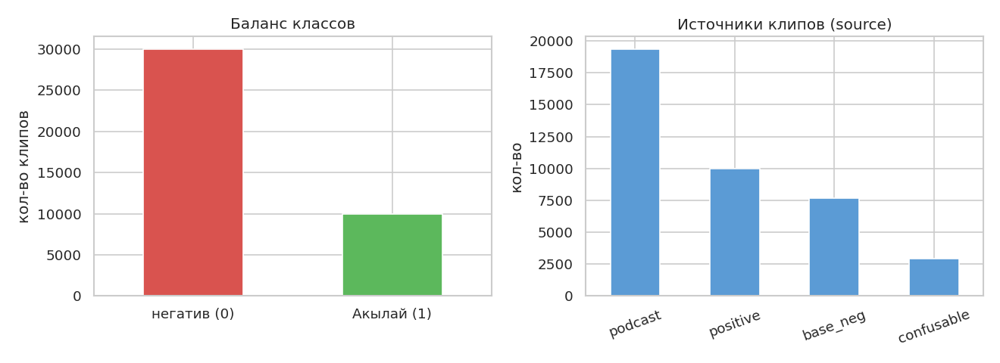

---

## Audio Sources

The negative class is composed of three different types of audio, making the classification task considerably more challenging than a standard binary classification problem.

| Source | Label | Description |
|----------|:----:|-------------|
| **positive** | 1 | Synthetic recordings containing the wake word **"Akylai"** |
| **base_neg** | 0 | Other synthetic words generated by the same TTS engine as the positive samples |
| **confusable** | 0 | Phonetically similar words generated by a different TTS engine |
| **podcast** | 0 | Real human speech extracted from Kyrgyz podcast recordings |

Unlike many binary classification datasets, the negative class is heterogeneous. It contains both synthetic and real speech, as well as phonetically similar words.

This dataset design makes it possible to evaluate not only overall classification performance but also how different models behave on various types of negative audio. In particular, the `source` metadata is later used to analyze false positive errors across different audio origins.

# 3. Exploratory Data Analysis

Before training the machine learning models, an exploratory data analysis (EDA) was conducted to better understand the dataset and assess the complexity of the classification task.

---

## Class Distribution

The first step was to examine the distribution of the target classes. As shown in the previous section, the dataset is moderately imbalanced, with approximately **25% positive** and **75% negative** samples.

Although the imbalance is not extreme, it makes **Accuracy** an insufficient evaluation metric. Therefore, the models are primarily evaluated using **Precision**, **Recall**, **F1-score**, **ROC-AUC**, and **PR-AUC** throughout this project.

---

## Feature Space Visualization

To gain an intuitive understanding of the data distribution, **Principal Component Analysis (PCA)** was applied to project the original 250-dimensional feature space onto two principal components.

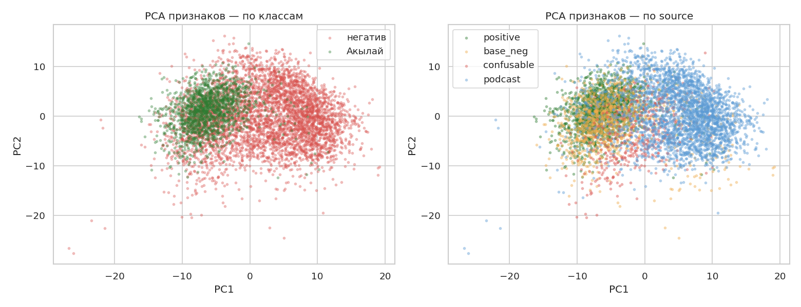

The visualization shows a substantial overlap between the positive and negative classes, indicating that the classification problem is non-trivial.

However, PCA preserves only a fraction of the information contained in the original feature space. Although the classes are not clearly separable in two dimensions, they can still be distinguished effectively in the full 250-dimensional feature space, allowing machine learning models to achieve high classification performance.

---

## Initial Observations

The exploratory analysis led to several important conclusions:

- The dataset is moderately imbalanced, making **F1-score** and **PR-AUC** more informative than Accuracy.
- The classes exhibit considerable overlap in the two-dimensional PCA projection, suggesting that simple linear separation in a reduced feature space is insufficient.
- The dataset contains multiple types of negative audio, motivating a source-based error analysis rather than treating all negative samples as a single group.
- The successful performance of the evaluated models indicates that the original high-dimensional acoustic feature space retains sufficient discriminative information for accurate keyword detection.

These observations guided the subsequent stages of the project, including model selection, evaluation strategy, and error analysis.

# 4. Data Preprocessing

Before training the machine learning models, the dataset was prepared for classification.

---

## Feature and Target Selection

The `label` column was used as the target variable, while the `source` column was excluded from the feature set because it contains metadata that is unavailable during inference.

Instead, `source` was preserved separately and used later for source-based error analysis.

```python
X = df.drop(columns=["source", "label"])
y = df["label"]
source = df["source"]
```

---

## Train-Test Split

The dataset was divided into training and testing subsets using an **80/20 split**.

To preserve the original class distribution in both subsets, **stratified sampling** was applied.

```python
X_train, X_test, y_train, y_test, source_train, source_test = train_test_split(
    X,
    y,
    source,
    test_size=0.2,
    stratify=y,
    random_state=42
)
```

The resulting split contains:

- **Training set:** 80%
- **Test set:** 20%
- **Random seed:** 42
- **Stratification:** enabled

---

## Feature Scaling

The dataset consists entirely of numerical acoustic features.

Feature scaling was applied **only to the linear models** (**Logistic Regression** and **SGDClassifier**) using **StandardScaler**.

```python
scaler = StandardScaler()

X_train_scaled = scaler.fit_transform(X_train)
X_test_scaled = scaler.transform(X_test)
```

Standardization transforms every feature to have:

- zero mean;
- unit variance.

This preprocessing step improves the convergence of optimization algorithms used by linear models and prevents features with larger numerical ranges from dominating the learning process.

Tree-based algorithms (**Decision Tree**, **Random Forest**, and **Gradient Boosting**) were trained on the original feature values because decision trees are invariant to feature scaling.

---

## Evaluation Strategy

To ensure a fair comparison, every model was trained on the same training set and evaluated on the same held-out test set.

The following metrics were used throughout the project:

- Accuracy
- Precision
- Recall
- F1-score
- ROC-AUC
- PR-AUC

Additionally, the evaluation included:

- confusion matrices;
- ROC curves;
- Precision–Recall curves;
- threshold optimization;
- feature importance analysis (for tree-based models);
- source-based false positive analysis.

This evaluation strategy provides a comprehensive comparison of model performance while taking class imbalance into account.

# 5. Baseline Model

Before evaluating machine learning algorithms, a baseline classifier was trained to establish a reference level of performance.

A **DummyClassifier** with the **most_frequent** strategy was selected as the baseline. This classifier always predicts the majority class (`label = 0`) and therefore does not learn any meaningful patterns from the data.

```python
baseline = DummyClassifier(strategy="most_frequent")

baseline.fit(X_train, y_train)

y_pred_baseline = baseline.predict(X_test)
```

---

## Baseline Performance

| Metric | Value |
|---------|------:|
| Accuracy | **0.7500** |
| Precision | **0.0000** |
| Recall | **0.0000** |
| F1-score | **0.0000** |
| ROC-AUC | **0.5000** |
| PR-AUC | **0.2500** |

---

## Discussion

Although the baseline classifier achieves an **Accuracy of 75%**, this result is misleading because of the class imbalance.

Since the model always predicts the majority class, it completely fails to detect the keyword **"Akylai"**, resulting in:

- **zero Precision**;
- **zero Recall**;
- **zero F1-score**.

The ROC-AUC score of **0.5** indicates random guessing, while the PR-AUC of **0.25** corresponds to the proportion of positive samples in the dataset, confirming that the classifier has no discriminative ability.

These results demonstrate why **Accuracy alone is not an appropriate evaluation metric** for the Keyword Spotting task and justify the use of Precision, Recall, F1-score, ROC-AUC, and PR-AUC throughout the remainder of the project.

The baseline serves as a lower performance bound. Every machine learning model evaluated in the following sections substantially outperforms this trivial classifier.

## 6.1 Logistic Regression

Logistic Regression was selected as the primary linear model due to its simplicity, interpretability, and strong performance on high-dimensional feature spaces.

The model estimates the probability that an audio clip contains the wake word

\[
P(\text{keyword}\mid x)
\]

A prediction is obtained by comparing this probability with a decision threshold.

---

### Hyperparameter Tuning

The optimal hyperparameters were selected using **GridSearchCV** with **5-fold cross-validation**.

| Parameter | Value |
|-----------|------|
| Solver | `liblinear` |
| Penalty | `L1` |
| C | **2.1544** |
| Class weight | `None` |

The selected configuration combines L1 regularization with moderate regularization strength, allowing the model to automatically discard less informative features while maintaining high predictive performance.

---

### Model Performance

| Metric | Value |
|---------|------:|
| Accuracy | **0.9576** |
| Precision | **0.9049** |
| Recall | **0.9280** |
| F1-score | **0.9163** |
| ROC-AUC | **0.9896** |
| PR-AUC | **0.9663** |

The model achieved excellent overall performance, demonstrating high precision and recall while maintaining outstanding ROC-AUC and PR-AUC values.

---

### Evaluation

| Confusion Matrix | ROC Curve | Precision-Recall Curve |
|:----------------:|:---------:|:----------------------:|
|  | 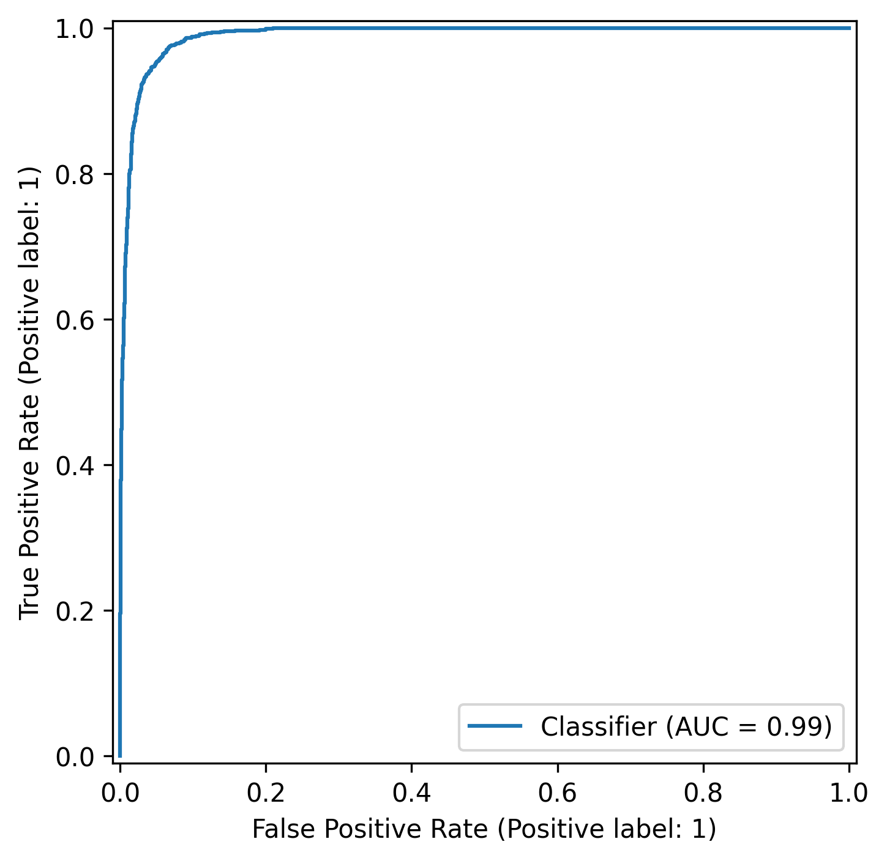 | 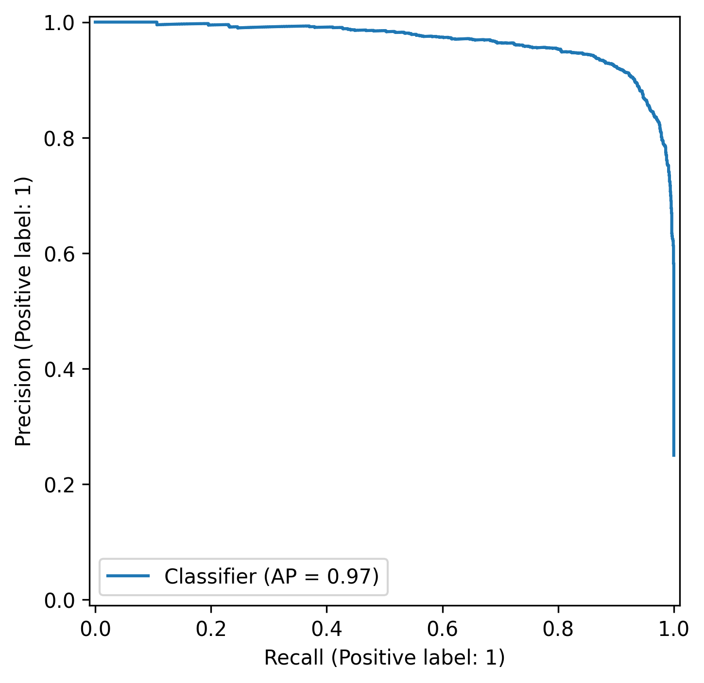 |

The confusion matrix shows that the classifier correctly identifies the vast majority of positive and negative samples with relatively few false positives and false negatives.

The ROC curve (AUC = **0.9896**) demonstrates excellent class separability, while the Precision–Recall curve confirms that the classifier maintains high precision even at high recall values, making it well suited for this imbalanced classification task.

---

### Error Analysis

False positive predictions were analyzed separately for each audio source.

Almost all false activations originated from the **base_neg** subset, while only isolated errors occurred on **confusable** and **podcast** recordings.

This indicates that the primary challenge for Logistic Regression is distinguishing the target keyword from other synthetic words generated by the same TTS engine rather than separating human speech from the keyword.

---

### Summary

Logistic Regression achieved the best overall balance between Precision, Recall, F1-score, computational efficiency, and model simplicity.

These characteristics ultimately led to its selection as the final model for deployment.

## 6.2 SGDClassifier

To evaluate another linear approach, an **SGDClassifier** was trained using stochastic gradient descent. Like Logistic Regression, this model was trained on standardized features, while its hyperparameters were optimized using **GridSearchCV** with **5-fold cross-validation**.

---

### Hyperparameter Tuning

The optimal hyperparameters are shown below.

| Parameter | Value |
|-----------|------|
| Alpha | **1.39 × 10⁻⁵** |
| Penalty | `elasticnet` |
| Class weight | `None` |
| Max iterations | **2000** |

The selected configuration combines **ElasticNet regularization** with a very small regularization coefficient, allowing the classifier to preserve most informative features while preventing overfitting.

---

### Model Performance

| Metric | Value |
|---------|------:|
| Accuracy | **0.9525** |
| Precision | **0.8966** |
| Recall | **0.9105** |
| F1-score | **0.9035** |
| ROC-AUC | **0.9870** |
| PR-AUC | **0.9566** |

Overall, SGDClassifier achieved strong classification performance, although it remained slightly behind Logistic Regression across all evaluation metrics.

---

### Evaluation

| Confusion Matrix | ROC Curve | Precision-Recall Curve |
|:----------------:|:---------:|:----------------------:|
| 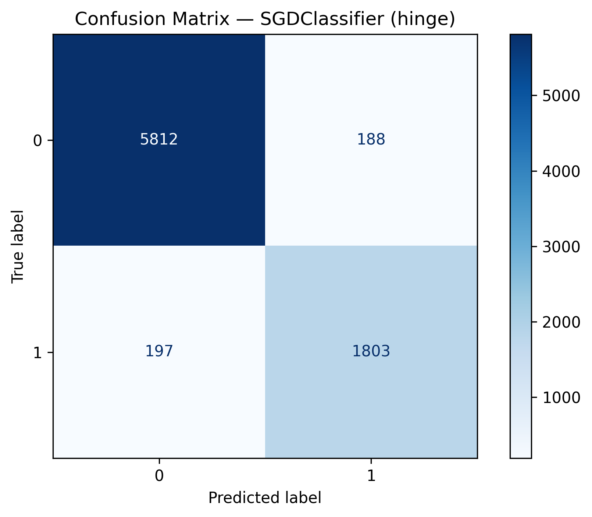 | 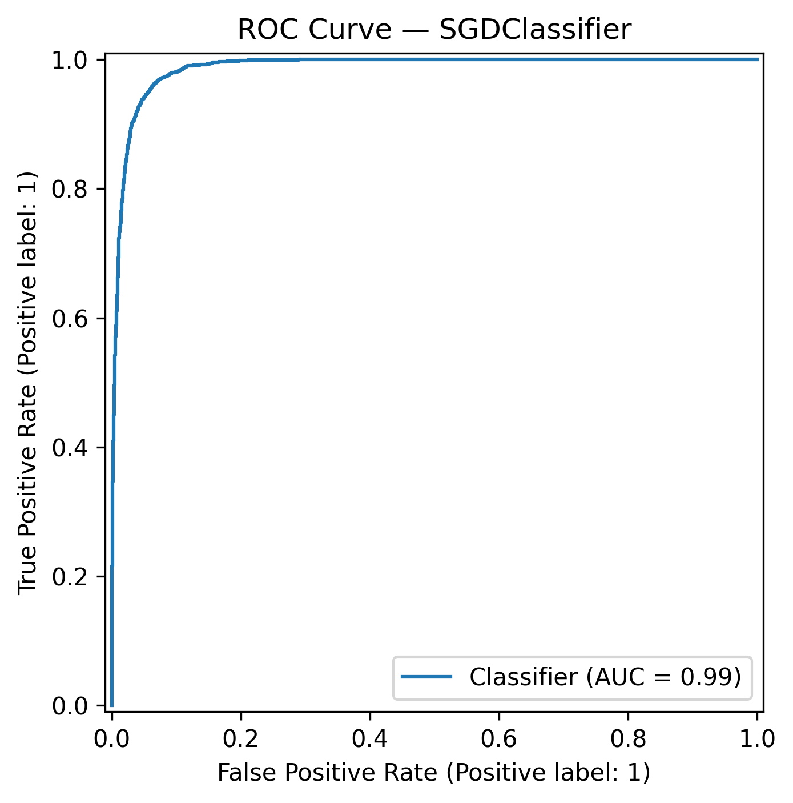 |  |

The confusion matrix indicates a small increase in both false positive and false negative predictions compared with Logistic Regression. Nevertheless, the ROC and Precision–Recall curves demonstrate excellent ranking performance, confirming that SGDClassifier is also well suited for the Keyword Spotting task.

---

### Feature Importance

Unlike tree-based models, feature importance in SGDClassifier is determined by the absolute values of the learned coefficients.

<p align="center">
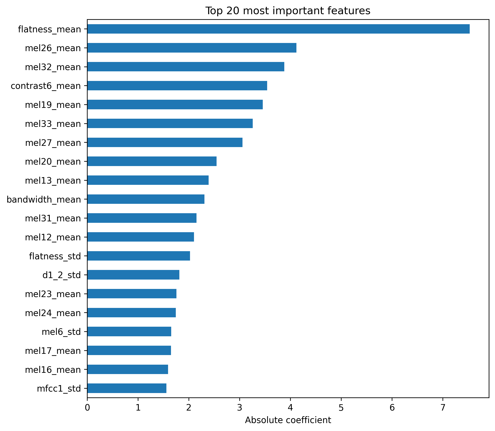
</p>

The most influential features are primarily related to **Mel-frequency coefficients**, **spectral flatness**, and **spectral contrast**, indicating that spectral characteristics of the audio signal play the dominant role in keyword detection.

---

### Summary

Although SGDClassifier achieved excellent performance, it consistently performed slightly worse than Logistic Regression in terms of F1-score, ROC-AUC, and PR-AUC.

Considering the superior overall performance of Logistic Regression, SGDClassifier was not selected as the final model despite being a strong linear baseline.

# 7. Tree-Based Models and Ensembles

While linear models provide strong baselines, they assume linear decision boundaries in the feature space. Tree-based algorithms, on the other hand, are capable of modeling complex non-linear relationships between acoustic features without requiring feature scaling.

Three tree-based approaches were investigated:

- Decision Tree
- Random Forest
- Gradient Boosting

Unlike the linear models, these algorithms were trained directly on the original feature values since decision trees are inherently invariant to feature scaling.

## 7.1 Decision Tree

A Decision Tree classifier was evaluated as the simplest non-linear model. Although individual decision trees are highly interpretable, they are also prone to overfitting if their complexity is not properly controlled.

---

### Model Complexity Analysis

Before performing hyperparameter optimization, two important parameters affecting model complexity were investigated:

- **Maximum tree depth (`max_depth`)**
- **Minimum number of samples per leaf (`min_samples_leaf`)**

The following figures illustrate how these parameters influence the model's ability to generalize.

| Maximum Depth | Minimum Samples per Leaf |
|:-------------:|:------------------------:|
| 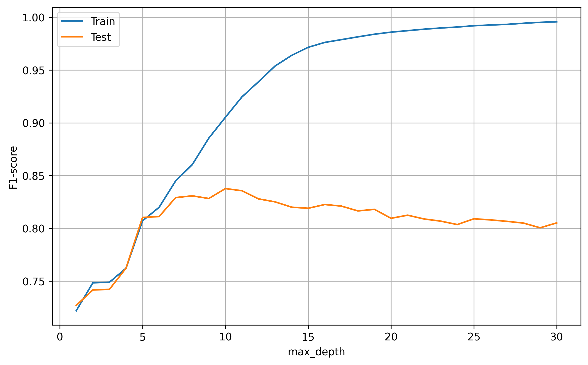 | 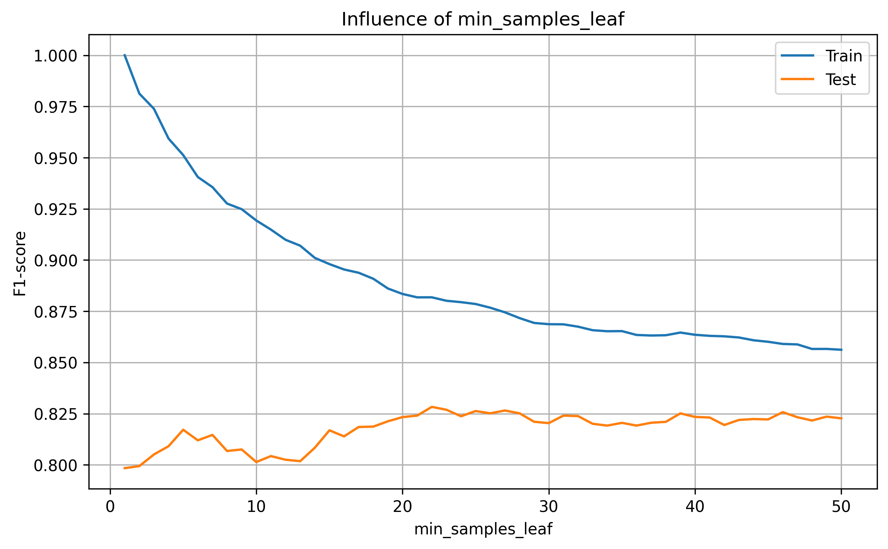 |

The experiments demonstrate the classical **bias-variance trade-off**. Increasing tree depth initially improves performance but eventually leads to overfitting, while increasing the minimum leaf size reduces variance and improves generalization.

---

### Hyperparameter Tuning

The final Decision Tree model was selected using **GridSearchCV** with **5-fold cross-validation**.

| Parameter | Value |
|-----------|------|
| Criterion | `entropy` |
| Maximum depth | **9** |
| Minimum samples per split | **2** |
| Minimum samples per leaf | **30** |
| Maximum features | `None` |

These parameters substantially reduced overfitting compared with the unrestricted baseline tree.

---

### Model Performance

| Metric | Value |
|---------|------:|
| Accuracy | **0.9123** |
| Precision | **0.8047** |
| Recall | **0.8570** |
| F1-score | **0.8300** |
| ROC-AUC | **0.9589** |
| PR-AUC | **0.8463** |

Although hyperparameter tuning noticeably improved the model, Decision Tree remained the weakest classifier among all evaluated machine learning algorithms.

---

### Evaluation

| Confusion Matrix | ROC Curve | Precision–Recall Curve |
|:----------------:|:---------:|:----------------------:|
|  | 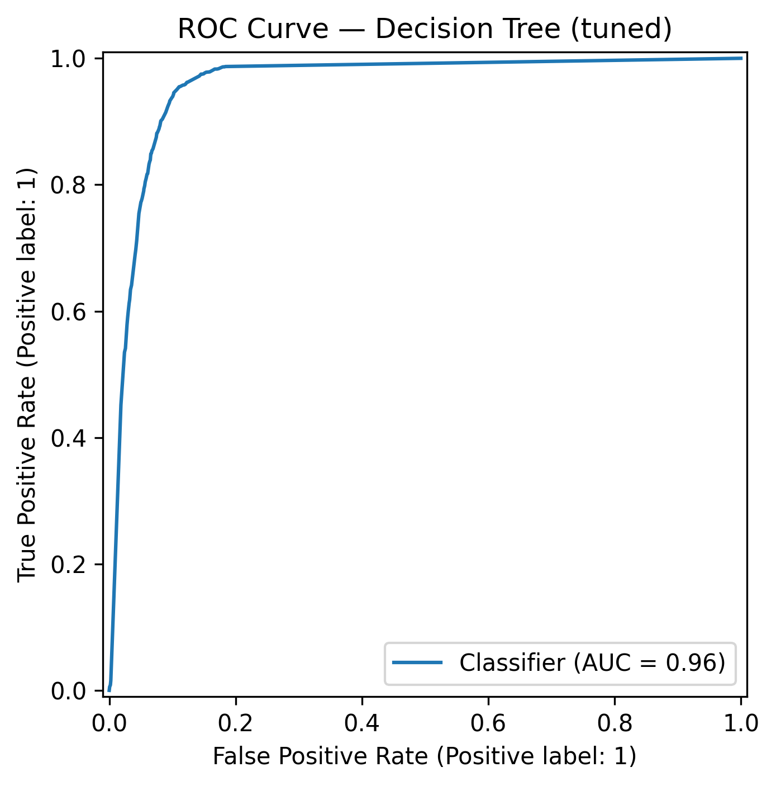 | 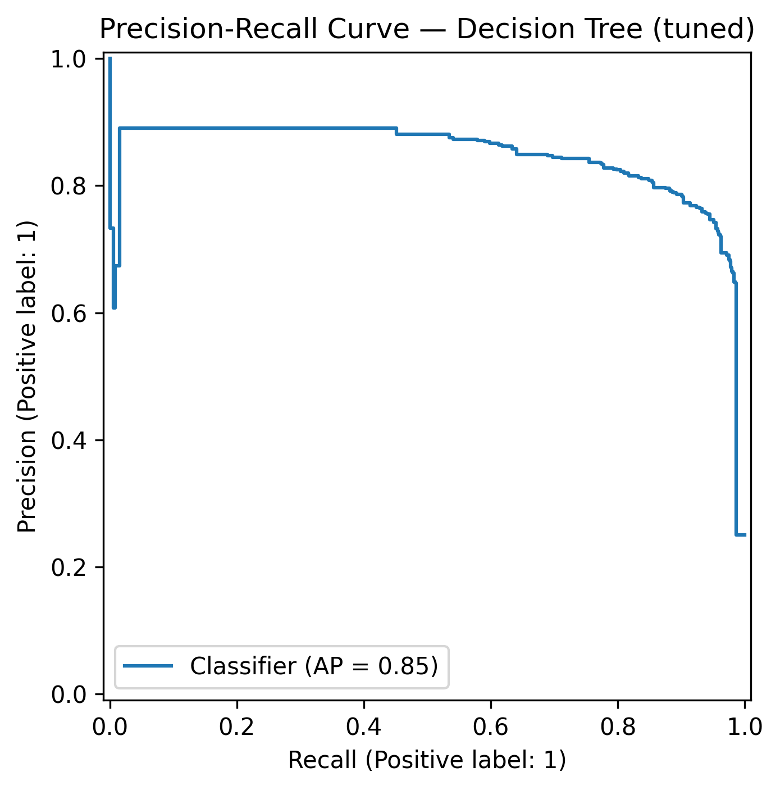 |

The Decision Tree produces considerably more false positives and false negatives than the linear models, resulting in lower Precision, Recall, and F1-score.

---

### Summary

Hyperparameter tuning substantially reduced overfitting and improved the model's generalization ability. Nevertheless, the Decision Tree still underperformed both linear classifiers, indicating that a single tree is not sufficiently robust for the Keyword Spotting task.

These observations motivate the use of ensemble methods, which combine multiple trees to improve predictive performance while reducing variance.

## 7.2 Random Forest

Random Forest extends the Decision Tree approach by combining multiple independently trained trees. Instead of relying on a single model, the final prediction is obtained by aggregating the predictions of many trees, which significantly reduces variance and improves generalization.

---

### Hyperparameter Analysis

Before tuning the final model, several important hyperparameters were investigated.

| Number of Trees | Maximum Depth | Maximum Features |
|:---------------:|:-------------:|:----------------:|
| 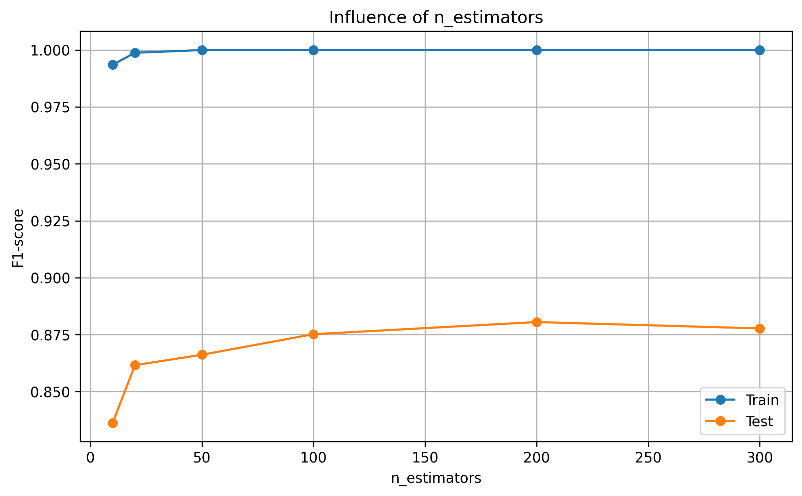 | 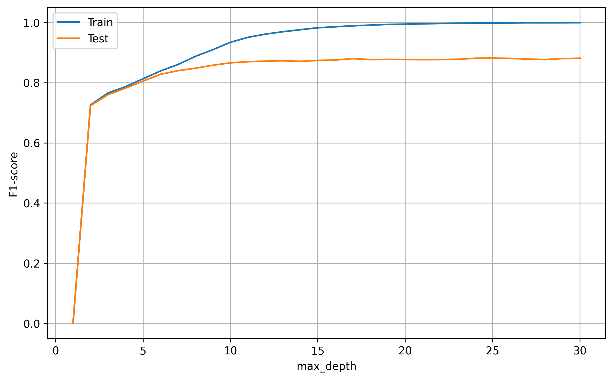 | 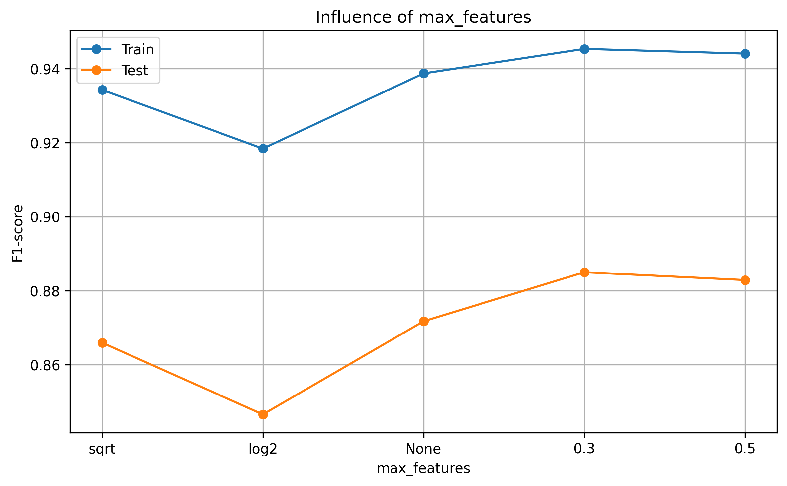 |

The experiments show that increasing the number of trees substantially improves performance during the initial stage, after which the improvement gradually saturates. Moderate tree depth provides the best balance between model complexity and generalization, while restricting the number of features considered at each split further improves robustness.

The influence of the minimum leaf size was also investigated.

<p align="center">
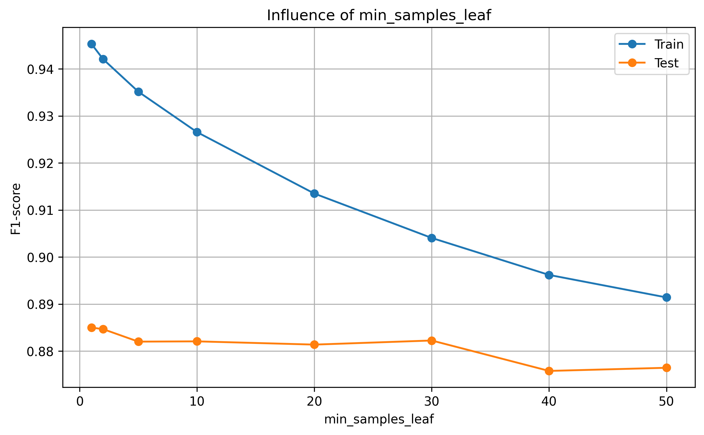
</p>

Increasing the minimum number of samples per leaf slightly reduces overfitting, although its influence on the final performance is considerably smaller than that of the other hyperparameters.

---

### Final Hyperparameters

Based on the experimental analysis, the following configuration was selected for the final Random Forest model.

| Parameter | Value |
|-----------|------|
| Number of trees | **200** |
| Maximum depth | **15** |
| Maximum features | **0.3** |
| Minimum samples per split | **5** |
| Class weight | `None` |

Rather than relying solely on automated hyperparameter optimization, the final configuration was chosen based on the observed behavior of the model across a series of controlled experiments. This approach makes it easier to interpret the influence of each hyperparameter while achieving strong predictive performance.

---

### Model Performance

| Metric | Value |
|---------|------:|
| Accuracy | **0.9434** |
| Precision | **0.8623** |
| Recall | **0.9205** |
| F1-score | **0.8904** |
| ROC-AUC | **0.9840** |
| PR-AUC | **0.9485** |

Compared with a single Decision Tree, Random Forest considerably improves all evaluation metrics and significantly reduces overfitting.

---

### Evaluation

| Confusion Matrix | ROC Curve | Precision–Recall Curve |
|:----------------:|:---------:|:----------------------:|
| 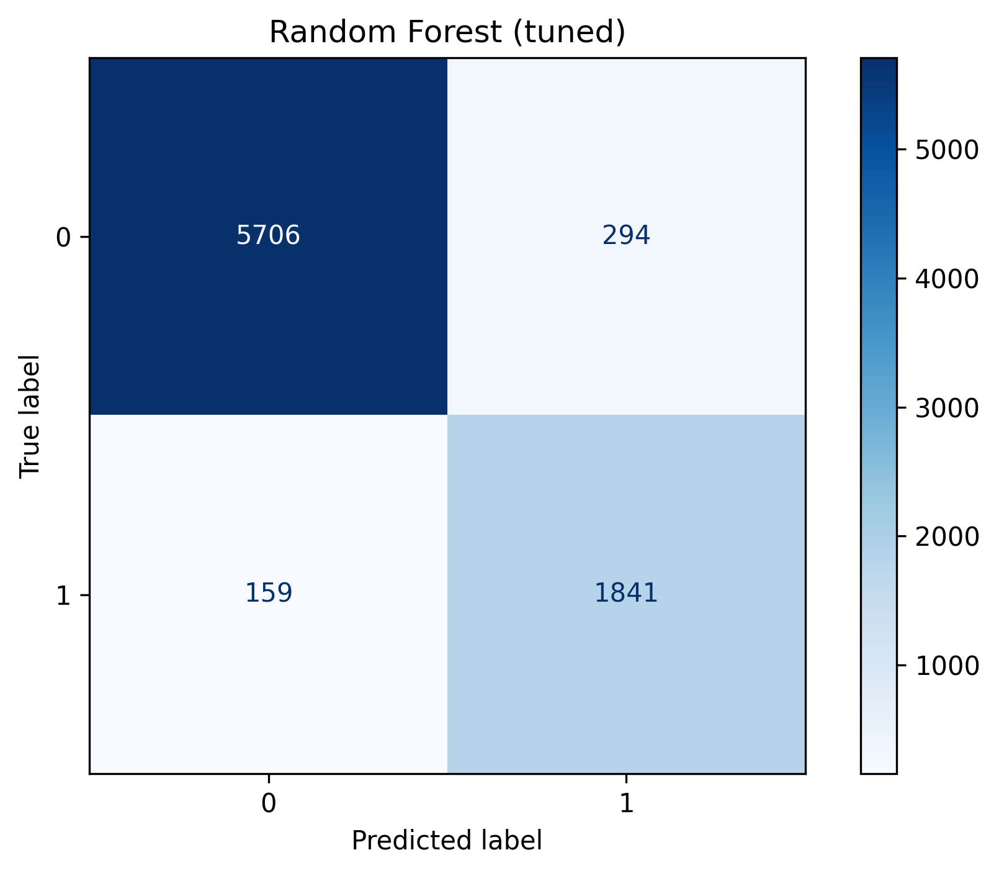 | 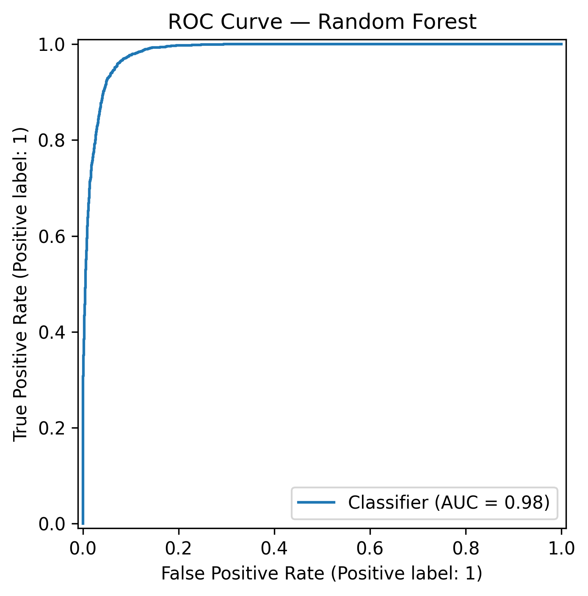 | 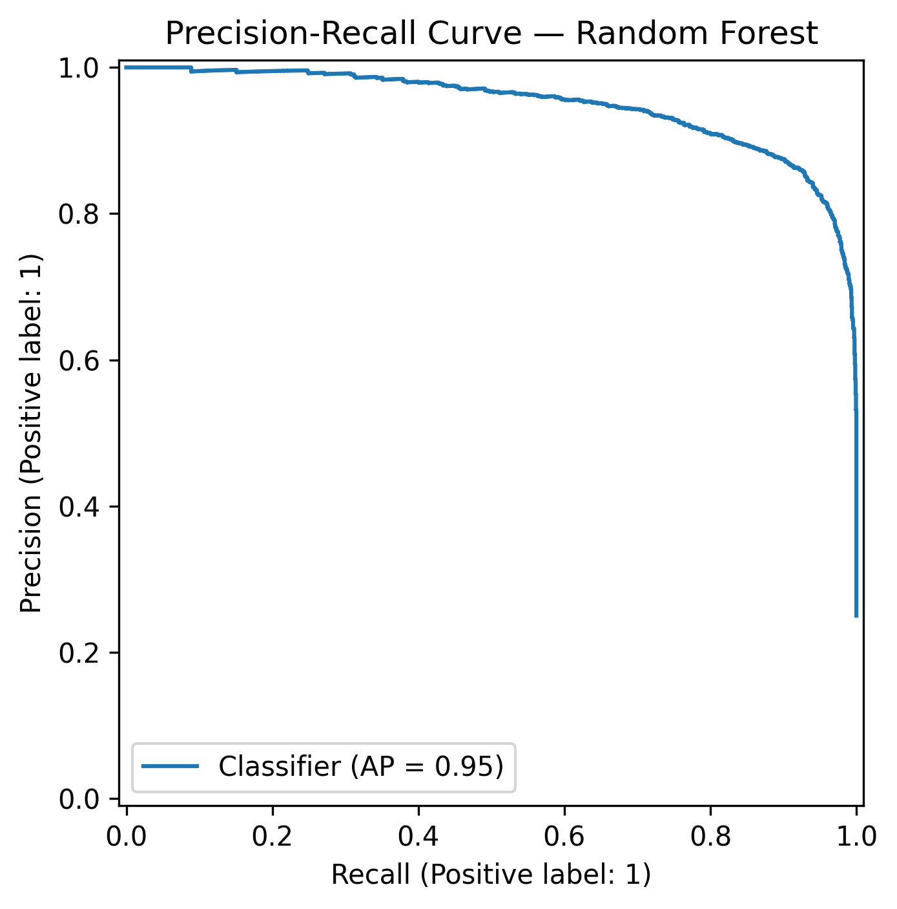 |

The confusion matrix demonstrates a substantial reduction in both false positive and false negative predictions compared with the Decision Tree.

The ROC and Precision–Recall curves confirm that Random Forest achieves much stronger ranking performance while maintaining stable classification quality across different decision thresholds.

---

### Feature Importance

Random Forest provides an estimate of feature importance based on the average impurity reduction across all trees.

<p align="center">
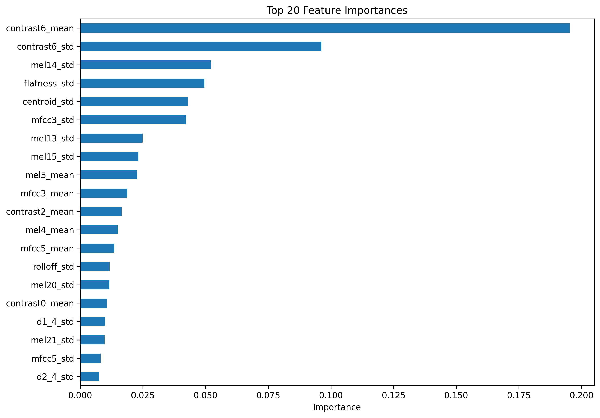
</p>

The most influential variables are primarily related to **Mel-frequency coefficients**, **spectral contrast**, and **spectral flatness**, confirming the observations obtained from the linear models.

---

### Summary

Random Forest successfully overcomes many of the limitations of a single Decision Tree by reducing model variance and improving generalization.

Although its performance is substantially better than that of the Decision Tree, it still remains slightly below the best linear model (Logistic Regression) and Gradient Boosting in terms of overall classification performance.

## 7.3 Gradient Boosting

Gradient Boosting builds an ensemble sequentially, where each new tree is trained to correct the mistakes made by the previous ones. Unlike Random Forest, which reduces variance by averaging independent trees, Gradient Boosting focuses on reducing bias through iterative error correction.

---

### Hyperparameter Analysis

The influence of the learning rate was investigated before tuning the final model.

<p align="center">
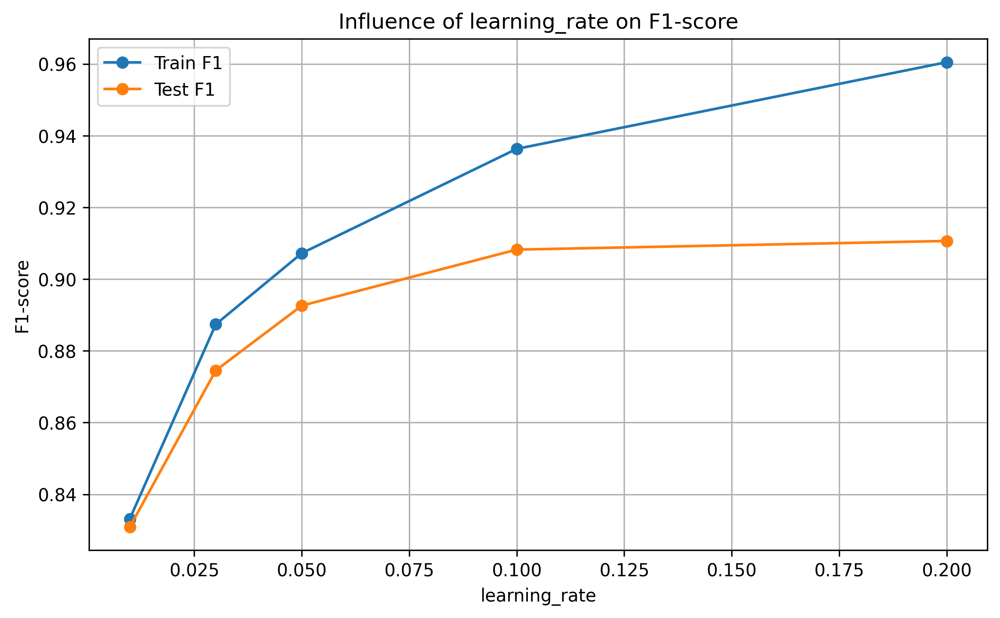
</p>

As expected, very small learning rates lead to underfitting, while larger values allow the model to converge more effectively. Performance improves rapidly as the learning rate increases and stabilizes around **0.2**, indicating a good balance between learning speed and generalization.

---

### Hyperparameter Tuning

The final Gradient Boosting model was selected using **RandomizedSearchCV** with **5-fold cross-validation**.

| Parameter | Value |
|-----------|------|
| Number of trees | **200** |
| Learning rate | **0.2** |
| Maximum depth | **3** |
| Minimum samples per leaf | **5** |
| Subsample | **1.0** |

The selected configuration combines shallow trees with a relatively high learning rate, allowing the model to achieve excellent predictive performance while maintaining good generalization.

---

### Model Performance

| Metric | Value |
|---------|------:|
| Accuracy | **0.9550** |
| Precision | **0.8988** |
| Recall | **0.9240** |
| F1-score | **0.9112** |
| ROC-AUC | **0.9899** |
| PR-AUC | **0.9668** |

Gradient Boosting achieved excellent overall performance and produced results comparable to Logistic Regression across all evaluation metrics.

---

### Evaluation

| Confusion Matrix | ROC Curve | Precision–Recall Curve |
|:----------------:|:---------:|:----------------------:|
| 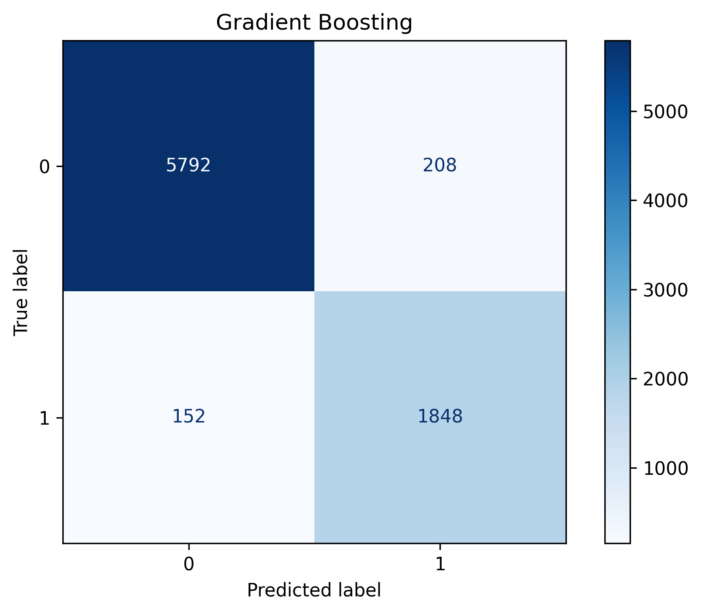 | 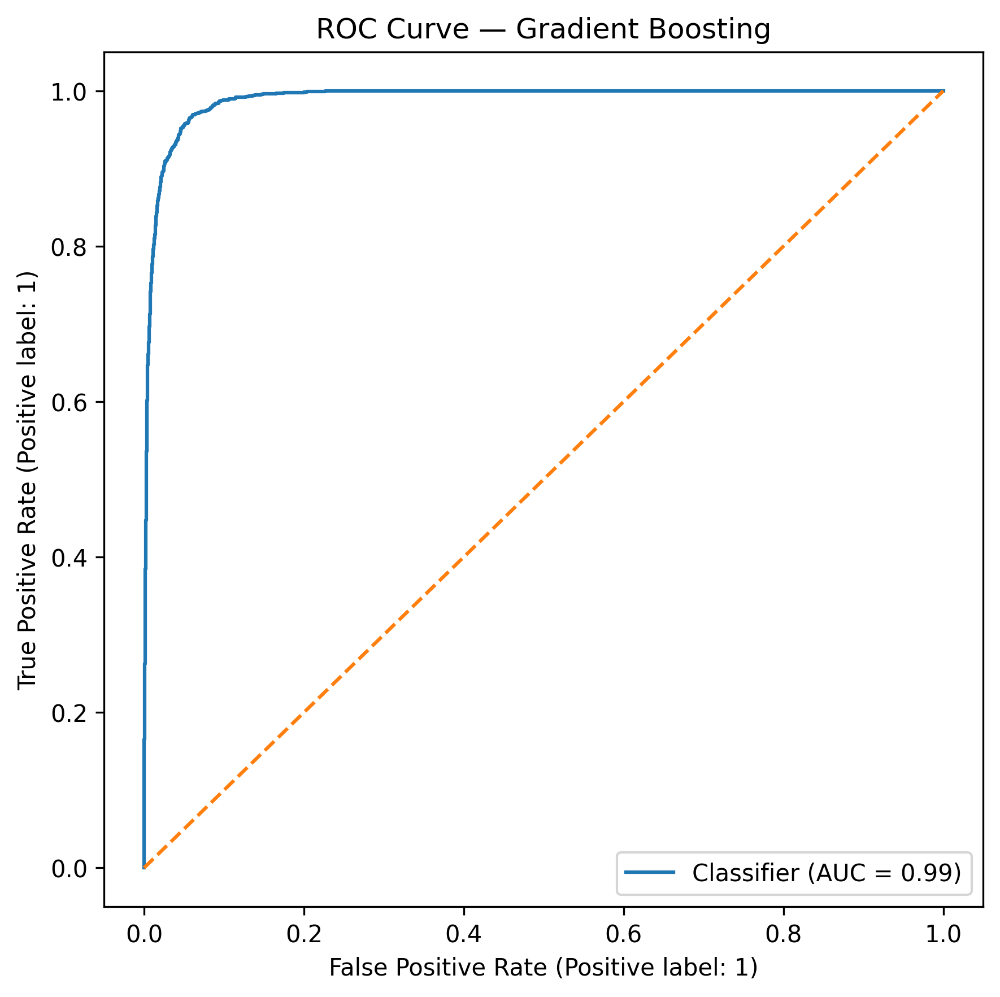 | 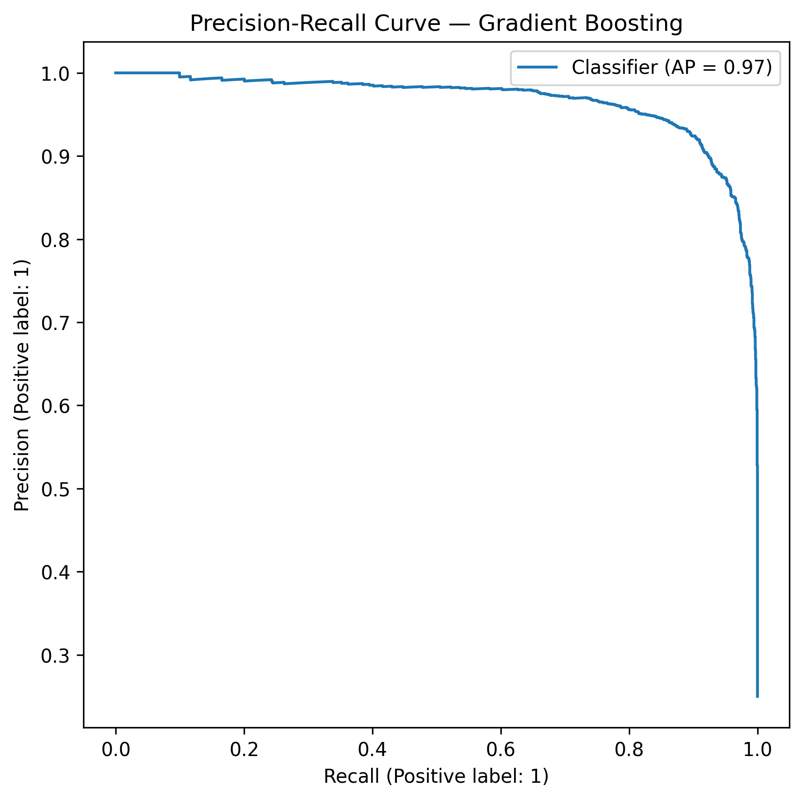 |

The confusion matrix shows that Gradient Boosting correctly classifies the vast majority of both positive and negative samples.

The ROC curve demonstrates excellent class separability, while the Precision–Recall curve confirms strong performance on this moderately imbalanced dataset.

---

### Feature Importance

Gradient Boosting estimates feature importance according to the contribution of each feature to the reduction of the loss function during boosting.

<p align="center">
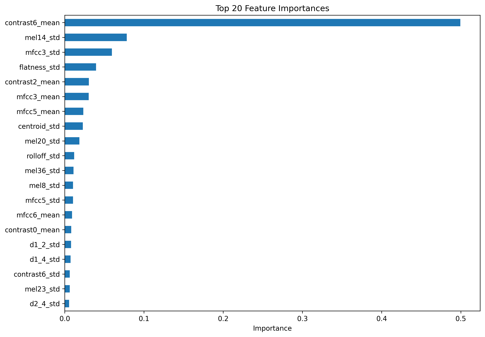
</p>

The most important features are again related to Mel-frequency coefficients and spectral characteristics of the audio signal, confirming the observations made with the previous models.

---

### Summary

Gradient Boosting achieved the strongest performance among the tree-based models and produced results nearly identical to Logistic Regression.

Although it slightly outperformed Logistic Regression in ROC-AUC and PR-AUC, the improvement was extremely small, while the linear model achieved a higher F1-score, better Recall, and substantially lower computational complexity.

For these reasons, Logistic Regression was selected as the final model for deployment.

# 8. Model Comparison

After evaluating all five machine learning models, their performance was compared using the same evaluation metrics.

| Model | Accuracy | Precision | Recall | F1-score | ROC-AUC | PR-AUC |
|------|---------:|----------:|-------:|---------:|--------:|-------:|
| Logistic Regression | **0.9576** | **0.9049** | **0.9280** | **0.9163** | 0.9896 | 0.9663 |
| SGDClassifier | 0.9525 | 0.8966 | 0.9105 | 0.9035 | 0.9870 | 0.9566 |
| Decision Tree | 0.9123 | 0.8047 | 0.8570 | 0.8300 | 0.9589 | 0.8463 |
| Random Forest | 0.9434 | 0.8623 | 0.9205 | 0.8904 | 0.9840 | 0.9485 |
| Gradient Boosting | 0.9550 | 0.8988 | 0.9240 | 0.9112 | **0.9899** | **0.9668** |

The comparison demonstrates that all machine learning models substantially outperform the baseline classifier.

Among the evaluated algorithms:

- **Logistic Regression** achieved the highest **F1-score** and **Recall**.
- **Gradient Boosting** produced the highest **ROC-AUC** and **PR-AUC**, although the improvement over Logistic Regression was marginal.
- **Random Forest** significantly outperformed a single Decision Tree by reducing variance and improving generalization.
- **Decision Tree** showed the weakest performance despite hyperparameter tuning.

Overall, Logistic Regression and Gradient Boosting emerged as the two strongest candidates for deployment.

# 9. Error Analysis

To better understand the behavior of the strongest models, false positive predictions were analyzed separately for each audio source.

A false positive occurs when the true label is `0`, but the model predicts `1`, meaning that the system falsely detects the wake word.

---

## False Positives by Source

| Model | base_neg | confusable | podcast |
|------|---------:|-----------:|--------:|
| Logistic Regression | **191 / 1508 (12.67%)** | 3 / 594 (0.51%) | 1 / 3898 (0.03%) |
| SGDClassifier | **188 / 1508 (12.47%)** | 0 / 594 (0.00%) | 0 / 3898 (0.00%) |
| Decision Tree | **413 / 1508 (27.39%)** | 2 / 594 (0.34%) | 1 / 3898 (0.03%) |
| Random Forest | **294 / 1508 (19.50%)** | 0 / 594 (0.00%) | 0 / 3898 (0.00%) |
| Gradient Boosting | **207 / 1508 (13.73%)** | 0 / 594 (0.00%) | 1 / 3898 (0.03%) |

---

## Key Findings

The analysis shows that false positive errors are highly concentrated in the **base_neg** subset.

For all models, the number of false activations on **confusable** and **podcast** samples is either extremely small or equal to zero. This suggests that the models are able to distinguish the wake word from:

- real human speech;
- phonetically similar words generated by another TTS engine.

The main source of errors is **base_neg**, which contains synthetic negative samples generated by the same TTS engine as the positive examples. This indicates that the classification difficulty is likely caused not by phonetic similarity alone, but by shared acoustic properties of the synthetic voice.

---

## Interpretation

The most difficult negative examples are not real podcast recordings or phonetically similar words. Instead, the hardest cases are synthetic non-keyword samples that share the same TTS characteristics as the positive keyword recordings.

This means that the model may partially react to acoustic patterns of the TTS engine rather than only to the linguistic content of the word.

Among the evaluated models:

- **SGDClassifier** produced the fewest false positives;
- **Logistic Regression** showed nearly the same false positive rate while achieving better overall metrics;
- **Gradient Boosting** was close to the linear models;
- **Random Forest** and especially **Decision Tree** produced substantially more false activations.

Overall, the error analysis confirms that **Logistic Regression** provides the best balance between overall classification quality and false positive control.


# 10. Final Model Selection

After comparing all evaluated algorithms, two models emerged as the strongest candidates for deployment:

- **Logistic Regression**
- **Gradient Boosting**

Although Gradient Boosting achieved slightly higher **ROC-AUC** and **PR-AUC**, the differences were extremely small.

| Metric | Logistic Regression | Gradient Boosting |
|---------|--------------------:|------------------:|
| Accuracy | **0.9576** | 0.9550 |
| Precision | **0.9049** | 0.8988 |
| Recall | **0.9280** | 0.9240 |
| F1-score | **0.9163** | 0.9112 |
| ROC-AUC | 0.9896 | **0.9899** |
| PR-AUC | 0.9663 | **0.9668** |

The results show that:

- Logistic Regression achieved higher **Recall** and **F1-score**.
- Gradient Boosting achieved slightly higher **ROC-AUC** and **PR-AUC**.
- The differences in ROC-AUC and PR-AUC were less than **0.1%**, making them practically negligible for this task.

Considering the nearly identical predictive performance, additional practical factors became important.

Logistic Regression offers several advantages:

- significantly faster training and inference;
- lower computational requirements;
- simpler deployment;
- easier interpretation of model decisions;
- fewer model parameters.

For these reasons, **Logistic Regression** was selected as the final model for deployment.

---

## Decision Threshold Selection

Instead of using the default decision threshold (**0.50**), an additional threshold optimization step was performed.

The objective was to maximize **Precision** while maintaining **Recall ≥ 0.90**. The optimal threshold was determined by evaluating multiple threshold values on the validation data.

| Model | Validation Threshold |
|--------|--------------------:|
| Logistic Regression | **0.60** |
| Gradient Boosting | **0.60** |

The figures below show how **Precision**, **Recall**, and **F1-score** change as the decision threshold varies for the two best-performing models.

| Logistic Regression | Gradient Boosting |
|:-------------------:|:-----------------:|
| 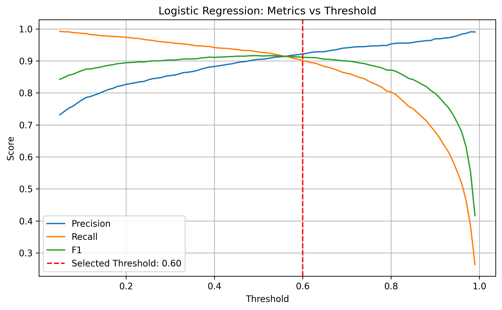 | 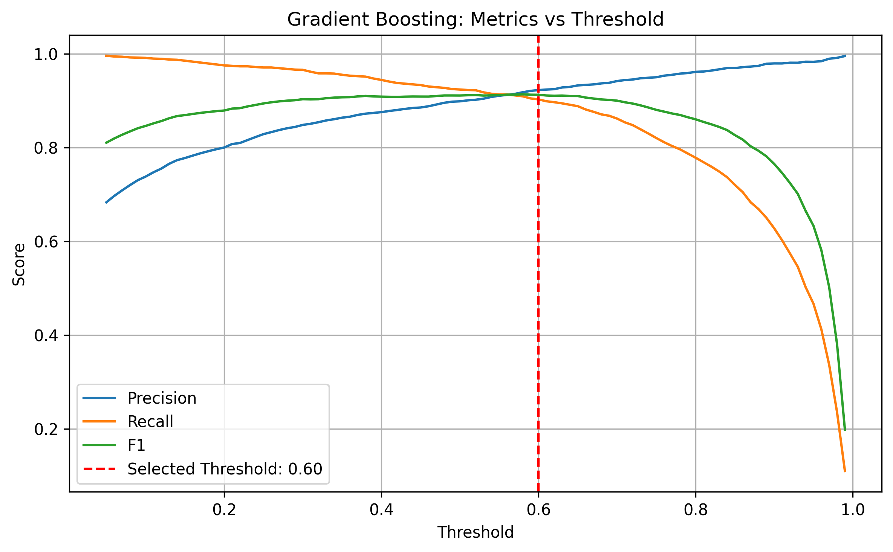 |

For both models, the validation procedure selected **0.60** as the optimal operating threshold because it achieved the highest precision while satisfying the recall constraint.

However, the threshold was further evaluated under a more realistic scenario using a manually recorded utterance of the wake word. Unlike the synthetic speech used throughout training and evaluation, the manually recorded audio produced consistently lower prediction probabilities. As a result, the validation threshold (**0.60**) failed to detect the keyword.

To improve real-world performance, the operating threshold was reduced to **0.45**. This threshold successfully detected the manually recorded keyword while still producing stable predictions on the synthetic recordings used throughout the project.

Since **Logistic Regression** was selected as the final deployment model, all subsequent streaming experiments use the threshold **0.45**.

The confusion matrix below corresponds to the final Logistic Regression model evaluated with the deployment threshold.

<p align="center">
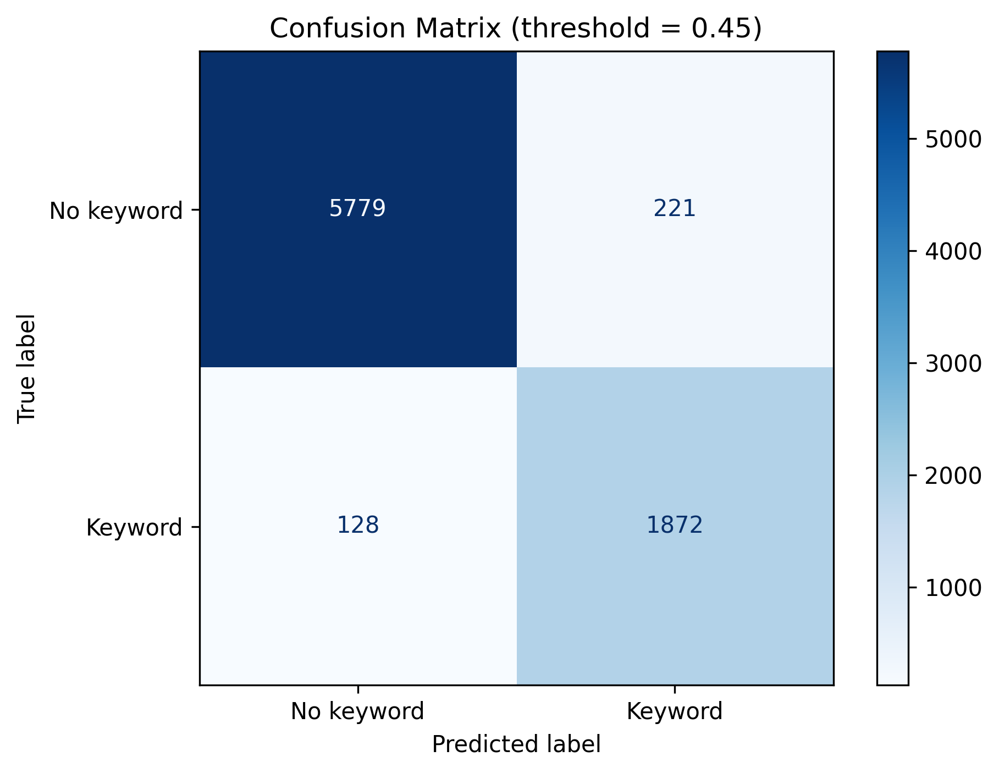
</p>

Compared with the validation threshold (0.60), the deployment threshold (0.45) improves wake-word detection on real human speech while maintaining stable behavior on the synthetic recordings used throughout the project.

---

# 11. Streaming Inference

After selecting the final model and the deployment threshold (**0.45**), the final stage of the project was to verify that the system can operate on **continuous audio streams** rather than isolated one-second clips.

A separate notebook (`Streaming_Demo.ipynb`) demonstrates the complete inference pipeline using the trained Logistic Regression model together with the provided `AudioPreprocessor`.

The streaming pipeline consists of the following stages:

1. **Sliding-window preprocessing**
   - the input audio is divided into overlapping windows;
   - the same acoustic features used during training are extracted from every window.

2. **Probability estimation**
   - the trained Logistic Regression model predicts the probability that each window contains the wake word.

3. **Temporal smoothing**
   - a moving average is applied to reduce short probability spikes and produce a more stable prediction signal.

4. **Thresholding**
   - the deployment threshold (**0.45**) is applied.

5. **Debounce**
   - repeated detections occurring within a short time interval are suppressed so that a single spoken keyword produces only one activation event.

---

## Demo Audio

The following recording contains several occurrences of the wake word **"Akylai"** and is used to demonstrate the streaming inference pipeline.

🔊 **Audio recording:** [▶️ `2026-06-07 20.33.07.wav`](2026-06-07%2020.33.07.wav)

<audio controls preload="none" src="2026-06-07%2020.33.07.wav">
Your browser does not support the audio element.
You can download the recording
<a href="2026-06-07%2020.33.07.wav">here</a>.
</audio>

---

## Streaming Prediction

The figure below illustrates the keyword probability produced by the model over time.

<p align="center">
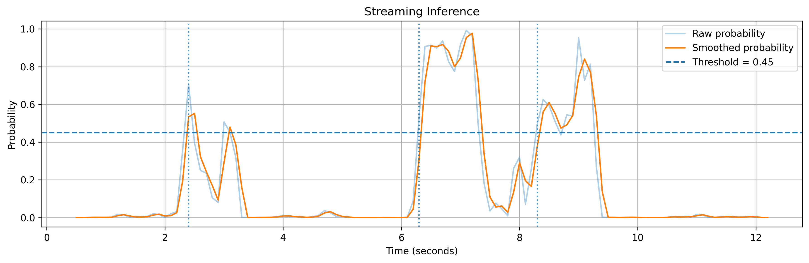
</p>

The light blue curve represents the raw probabilities predicted by the classifier, while the orange curve shows the probabilities after temporal smoothing.

The dashed horizontal line corresponds to the deployment threshold (**0.45**), and the vertical markers indicate the final wake-word detections after applying the debounce mechanism.

The experiment demonstrates that the complete streaming pipeline is capable of processing continuous audio and producing stable wake-word detections suitable for real-time inference.

---

## Additional Experiment: Human Speech

To evaluate how the trained model behaves on audio outside the training distribution, an additional experiment was conducted using a manually recorded utterance of the wake word.

🔊 **Audio recording:** [▶️ `20260702_200722516.wav`](20260702_200722516.wav)

<audio controls preload="none" src="20260702_200722516.wav">
Your browser does not support the audio element.
You can download the recording
<a href="20260702_200722516.wav">here</a>.
</audio>

<p align="center">
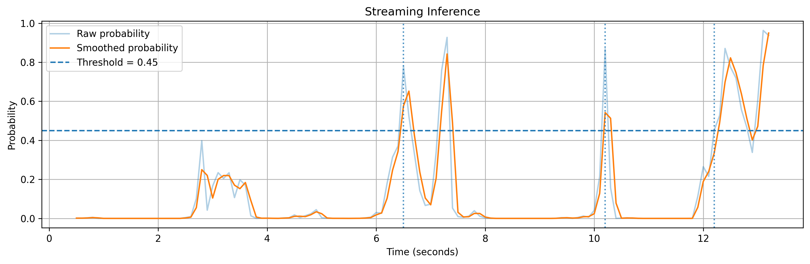
</p>

The manually recorded speech produced noticeably lower prediction probabilities than the synthetic recordings used for training. With the validation threshold (**0.60**), the keyword was not detected. Lowering the threshold to 0.45 increased sensitivity sufficiently to detect the manually recorded wake word without introducing unstable behavior on the synthetic streaming examples.

This experiment highlights an important limitation of the current model: the positive training examples consist entirely of **synthetic TTS recordings**, while the model was never exposed to real human pronunciations during training. Consequently, the probability estimates for real speech are systematically lower.

Although the streaming pipeline itself operates correctly, improving robustness on real-world recordings would require extending the training dataset with manually recorded examples or applying domain adaptation techniques.

# 12. Project Structure

The repository is organized as follows:

```text
kws-project/
│
├── img/
│   ├── LR_confusion_matrix.png
│   ├── LR_roc_curve.png
│   ├── LR_precision_recall_curve.png
│   ├── ...
│   └── streaming_inference_plot.png
│
├── models/
│   ├── logistic_regression_kws.pkl
│   └── threshold.pkl
│
├── notebooks/
│   ├── Akylai_KWS_Project.ipynb
│   └── Streaming_Demo.ipynb
│
├── utils/
│   ├── __init__.py
│   ├── feature_extractor.py
│   └── stream_preprocessor.py
│
├── config.yaml
├── Makefile
├── requirements.txt
├── README.md
└── .gitignore
```

### Directory Description

| Path | Description |
|------|-------------|
| `img/` | Figures used in the README, including confusion matrices, ROC curves, Precision–Recall curves, feature importance plots, threshold analysis, and streaming inference visualization. |
| `models/` | Trained machine learning models saved for inference. |
| `notebooks/` | Jupyter notebooks containing the complete machine learning workflow and the streaming inference demonstration. |
| `utils/` | Utility modules for feature extraction and real-time audio preprocessing. |
| `config.yaml` | Configuration of the acoustic feature extraction pipeline. |
| `Makefile` | Convenience commands for installing dependencies and running the project. |
| `requirements.txt` | Python package dependencies. |
| `README.md` | Project documentation. |

# 13. Installation

Clone the repository:

```bash
git clone https://github.com/lunarrray/kws-project.git
cd kws-project
```

Create a virtual environment:

```bash
python3 -m venv venv
```

Activate it.

**Linux / macOS**

```bash
source venv/bin/activate
```

**Windows**

```bash
venv\Scripts\activate
```

Install the required packages:

```bash
pip install -r requirements.txt
```

Run the notebooks in the following order:

1. Akylai_KWS_Project.ipynb
2. Streaming_Demo.ipynb

Launch Jupyter Notebook:

```bash
jupyter notebook
```

Open:

- `notebooks/Akylai_KWS_Project.ipynb` — complete machine learning pipeline, including exploratory data analysis, model comparison, hyperparameter tuning, threshold selection, and error analysis.
- `notebooks/Streaming_Demo.ipynb` — demonstration of streaming keyword spotting on continuous audio.

The trained Logistic Regression model and the selected deployment threshold are stored separately and can be loaded as follows:

```python
import joblib

model = joblib.load("../models/logistic_regression_kws.pkl")
threshold = joblib.load("../models/threshold.pkl")
```

The streaming demo uses the shared preprocessing pipeline implemented in `utils/stream_preprocessor.py`, ensuring that exactly the same acoustic features are extracted during both training and inference.

# 13. Conclusion

This project presented a complete machine learning workflow for the Keyword Spotting task, where the objective was to detect the Kyrgyz wake word **"Akylai"** in short audio clips.

Several classification algorithms were evaluated, including Logistic Regression, SGDClassifier, Decision Tree, Random Forest, and Gradient Boosting. Their performance was compared using Accuracy, Precision, Recall, F1-score, ROC-AUC, and PR-AUC, followed by hyperparameter tuning, threshold optimization, and detailed error analysis.

The experiments showed that **Logistic Regression** achieved the best overall balance between predictive performance, computational efficiency, and model simplicity. Despite being a linear model, it matched or outperformed more complex tree-based approaches on most evaluation metrics while remaining fast to train and suitable for real-time deployment.

The error analysis revealed that almost all false activations originated from the **base_neg** subset, whereas false positives on **confusable** and **podcast** samples were almost nonexistent. This indicates that the primary challenge of the task is distinguishing the target keyword from other words synthesized by the same TTS engine rather than separating speech from background audio or phonetically similar words.

To make the model suitable for deployment, an operating threshold was selected based on the Precision–Recall trade-off while maintaining high Recall. The final model was then integrated into a streaming inference pipeline using a sliding-window approach, temporal smoothing, and debounce logic. The streaming demonstration confirmed that the system can successfully detect occurrences of the wake word in continuous audio while suppressing unstable predictions.

Overall, the project demonstrates not only the development of an accurate binary classifier but also the complete engineering workflow required to transform a machine learning model into a practical wake-word detection system.
